### 									面向异构SoC的函数调用机制

#### 框架结构

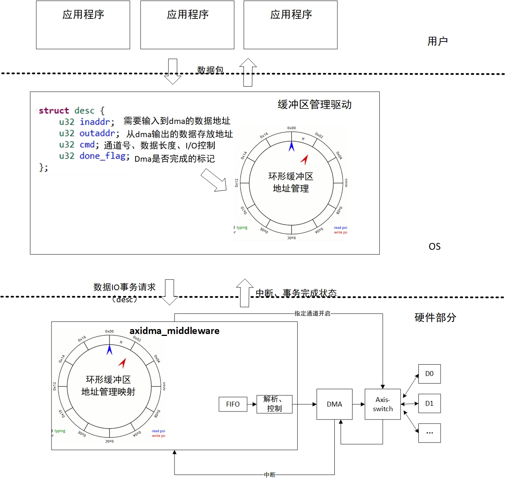

__常见异构SoC的框架结构图以及分析：__

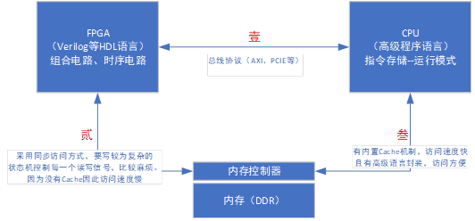

（壹）：FPGA与CPU之间通常采用总线传输协议，即AXI、PCIE等。FPGA内的模块通常作为外设模块挂载在总线上，每个模块分配一个物理地址。在CPU中运行的程序直接通过物理地址对FPGA内模块进行读写访问。

（贰）：FPGA要访问内存时，通常采用同步访问方式，要实现较为复杂的状态机控制每一个读写信号，比较麻烦。另外，因为没有Cache因此访问速度慢。

（叁）：CPU有内置Cache机制，访问速度快；且有高级语言封装，对于程序员来说不用考虑同步和异步问题，访问方便。

（补充）：FPGA内部通常集成了存储空间和DSP模块（用于浮点计算），但资源较少，无法与CPU的三级存储结构效率和易用性相提并论。

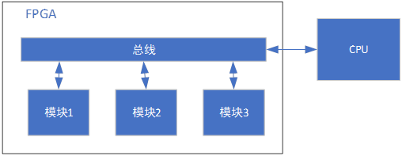

__基本思路：__

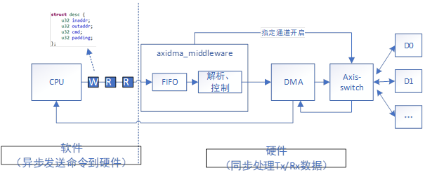

上图为实现的模块的逻辑连线图，核心模块介绍如下：

1. CPU中运行Linux操作系统（xilinx提供的petalinux套件），测试环境下运行xilinx SDK（即无操作系统的裸机环境）
2. DMA（direct memory access）是传统计算机中常见用于在设备和内存之间建立直接传输通道的模块，通常用于传输大块内存空间，降低cpu拷贝数据开销
3. Axis\-switch：在zynq Soc中，模块之间通常使用axi总线进行连接，axi总线分为内存映射总线（简写axi4）和axi\-stream（简写axis）流式总线，axis不进行内存映射，建构和逻辑简单。所以在FPGA中实现的功能模块优先选择使用axis进行模块间的数据传输；除非要访问内存物理地址（或虚拟地址），则一般不使用axi4总线接口。Axis\-switch模块的功能是通过外部控制信号进行流数据的路由，即在同一时间段内只允许DMA与一个功能模块进行通讯。
4. Axidma\_middleware：自己写的功能模块，主要作用是将CPU原本发送给DMA的控制信息（读或写）截获下来存入FIFO中，然后由模块控制串行完成请求。即CPU与DMA原本是同步的控制行为变成了异步，本模块再与dma构成同步串行控制。

__基本实现逻辑：__

__（1）修改之前的情况分析__

通常情况下，CPU与FPGA中的功能模块逻辑连接如下图中的两种方式。第一种方式中每个模块单独配置一个DMA然后与CPU连接。CPU要去模块取数据或写数据时需要对每一次的读写请求配置对应的DMA模块，主要包括读回来的数据将要存放的内存地址，以及想要写的数据目前存放的内存地址、将要读写数据的长度（字节）。

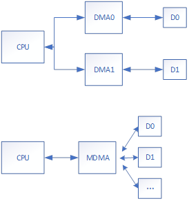

CPU即软件中运行的配置代码示例如下：

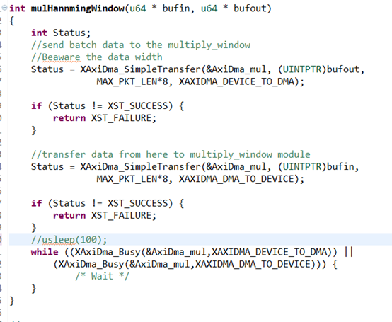

该示例代码主要功能是配置一次读、写请求，即写入一块数据（大小为MAX\_PKT\_LEN\*8字节），然后从设备中读到计算完后的输出数据。Bufin和bufout分别为待写入数据的内存起始地址与为读取数据申请的空内存块起始地址。XAxiDma\_SimpleTransfer函数为SDK提供的DMA配置接口，XAXIDMA\_DEVICE\_TO\_DMA为读方向（从device通过dma读回来），XAXIDMA\_DMA\_TO\_DEVICE为写方向（通过dma写到device）。最后的while循环为轮询等待dma是否完成读写任务（可以改成中断形式进行）。

在这种设置下，CPU需要配置的内容比较多，性能相对差

__（2）修改之后的情况分析__

在插入了Axidma\_middleware模块后，软件端对dma的配置如下所示。

首先，对dma的配置被打包成一个结构体即一块内存空间，包括了地址以及长度、通道号（通道号要与硬件设置进行匹配）与方向。方向配置包括三种，即单读、单写、读写。打包好一个结构体后，向Axidma\_middleware模块接口地址进行写入。即下图的memcpy。地址是由硬件端设定。

其次，向接口发送完命令后，CPU即可完成别的工作。这里写的while循环是轮询等待作用，是测试用的，正式版可以改成中断（还未完全实现）。下图给了两个例子，一个是写（MM2S，即master to slave），一个是同时读写（RWBOTH）。

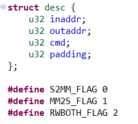

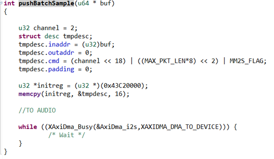

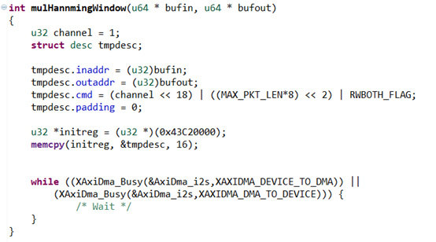

===========================================================================================================================__以下为过时废弃内容__===================================

=======================================================================================

基本结构：

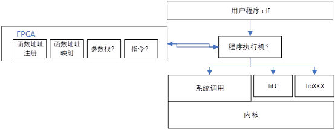

__【CPU访问FPGA资源】：__

基本思路：

1. 用户程序在调用库函数时，自动对被调函数入口地址进行匹配：匹配成功则自动调用FPGA内部模块，否则调用原函数地址。
2. FPGA内的模块动态加载和进行函数注册与映射
3. 要使本结构正常工作，需要对系统执行程序的机制进行修改（或者用一个显式的程序对可执行文件单独进行一次扫描，替换入口地址）

程序编译运行过程：

1. 编译器不做修改，程序正常流程进行编译链接生成可执行文件
2. 程序运行开始，将程序读入进程，进行相关解释运行【这里需要对ELF文件执行流程进行详细了解】
3. 对于每一个程序段，根据FPGA中保存的函数地址映射关系，动态修改入口地址
4. FPGA和软件中的库不需要了解其功能是由谁调用的。

__【FPGA端访问CPU资源】__：

所谓的CPU资源即使用高级程序语言实现的各类功能，功能以函数的形式体现。对于软件开发者来说，还是以原来的方式编写程序。可以实现如下两种方式，即面向异步执行的函数调用，以及面向同步执行的函数调用：

A）面向异步执行的函数调用：

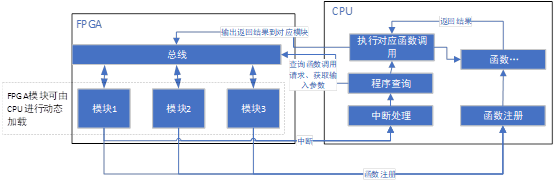

流程：

1. FPGA中模块进行初始化时，向CPU进行函数注册，即注册需要调用的函数。CPU将函数与模块进行匹配注册
2. 在运行中，需要调用函数时，模块向CPU发送中断请求
3. CPU响应中断，进行程序查询操作，即查询模块的函数调用请求。并取得对应输入参数
4. 调用对应函数，把函数预期运行时间写入fpga模块寄存器
5. 函数运行结束，将运行结果和状态写回fpga模块寄存器

FPGA模块运行状态机：

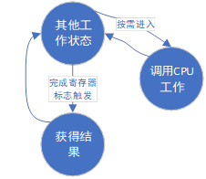

fpga寄存器定义：

R0：CPU函数调用寄存器，存的数字与CPU提供的函数号对应，需要在初始化时进行相关的注册工作

R1：CPU函数调用状态寄存器，记录函数调用状态与调用形式，比如正在运行中、调用返回正确、调用返回错误、调用的输入和返回形式等

R2……：函数输入参数，可以是直接参数或间接参数（地址）

Rx……：函数返回值，可以是直接参数或间接参数（地址）

B）面向同步执行的函数调用：

暂略

